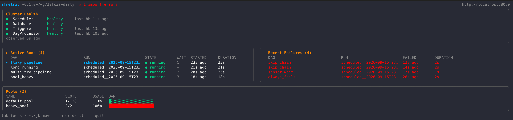

# afmetric

Terminal dashboard for monitoring Apache Airflow production clusters.
Polls the REST API and renders a real-time TUI of scheduler health, active
DAG runs, recent failures and pool utilisation, with drill-down into task
instances of any run.

Built with Go, [Bubble Tea](https://github.com/charmbracelet/bubbletea) and a
typed client generated from Airflow's OpenAPI spec.



## Why

- **Read-only.** Everything is polled via the REST API — no need to expose
  a StatsD/OTel endpoint from prod.
- **Realistic latency.** ~5s for health & DAG runs, ~30s for pools, tunable.
  Not sub-second, but honest.
- **One binary, no runtime.** Ships as a static Go executable.
- **Zero-config.** All settings via env vars and CLI flags — no YAML/TOML
  to babysit. Multi-cluster? Shell alias per cluster.
- **Self-throttling.** Built-in Guard doubles poll intervals when the API
  returns errors and dials them back when it recovers.

## Install

```
go install github.com/duo-moon/airflow-metric-cli/cmd/afmetric@latest
```

Or clone and build:

```
git clone https://github.com/duo-moon/airflow-metric-cli
cd airflow-metric-cli
make build   # -> bin/afmetric
```

## Quick start

```
export AIRFLOW_URL=https://airflow.example.com
export AIRFLOW_TOKEN=your-bearer-token   # or AIRFLOW_USERNAME/AIRFLOW_PASSWORD
./bin/afmetric ping    # verify connectivity
./bin/afmetric run     # launch the TUI
```

## Configuration

`afmetric` reads two layers, highest priority first:

1. CLI flags (`--url`, `--timeout`, `--api-version`, …).
2. Environment variables: `AIRFLOW_URL`, `AIRFLOW_TOKEN`, or
   `AIRFLOW_USERNAME` + `AIRFLOW_PASSWORD`.

That's it — no config file. Multi-cluster setups live in the shell:

```bash
# ~/.bashrc
alias af-prod='AIRFLOW_URL=https://airflow.prod.example.com \
               AIRFLOW_TOKEN="$PROD_TOKEN" \
               afmetric --api-version v2'

alias af-stage='AIRFLOW_URL=https://airflow.stage.example.com \
                AIRFLOW_USERNAME=alice AIRFLOW_PASSWORD="$STAGE_PASSWORD" \
                afmetric'
```

Then: `af-prod run`, `af-stage ping`.

## Commands

| Command   | Purpose                                                            |
|-----------|--------------------------------------------------------------------|
| `run`     | Launch the TUI dashboard.                                          |
| `ping`    | One-shot check of connectivity, Airflow version, component health. |
| `version` | Build info.                                                        |

## TUI keys

| Key           | Action                                        |
|---------------|-----------------------------------------------|
| `tab`         | Switch focus between Active / Failures panels |
| `↑` `↓` `j` `k` | Move cursor in focused panel                |
| `enter`       | Drill into task instances of selected run     |
| `esc` `←` `h` | Back to dashboard                             |
| `r`           | Force redraw                                  |
| `q` `ctrl+c`  | Quit                                          |

## REST API dialects (v1 and v2)

afmetric ships two generated clients — one per Airflow REST API dialect —
behind a single `AirflowClient` interface, so every panel works identically
regardless of which one you point it at.

| `--api-version` | Path prefix | Framework  | Typical Airflow release | Pinned spec (see `api/VERSION`) |
|-----------------|-------------|------------|-------------------------|---------------------------------|
| `v1` (default)  | `/api/v1`   | Connexion  | 2.x                     | apache/airflow 2.11.2           |
| `v2`            | `/api/v2`   | FastAPI    | 3.x                     | apache/airflow 3.2.0            |

The mapping «Airflow product version → dialect» is a convention today, not a
hard rule — the adapter is chosen strictly by `--api-version`. Auth is
also dialect-specific: `v1` accepts basic or bearer, `v2` accepts bearer
only (JWT); the client rejects APIv2 + basic-auth at construction time.

```
export AIRFLOW_URL=https://airflow.example.com
export AIRFLOW_TOKEN=<jwt-or-personal-token>
afmetric --api-version v2 ping
afmetric --api-version v2 run
```

Dialect-specific quirks (v2 needs `~` wildcards for batched endpoints, its
log endpoint returns a structured-message union instead of plain content)
live inside the adapter — callers just do `cli.DagRuns(...)` and get back
`[]model.DagRun`.

## Rate-limit guard

If Airflow's API starts returning errors above 50% for a task, the Guard
doubles that task's polling interval (up to `--guard-max`, default 2 min).
Once a clean window arrives it halves back down to the baseline. Disable
with `--no-guard`.

## Development

```
make generate   # re-run oapi-codegen for both v1 and v2 specs
make test       # go test -race ./...
make lint       # golangci-lint run ./...
make build      # bin/afmetric with -ldflags version info
```

`oapi-codegen` is pinned in `go.mod` as a `tool` directive, so the generate
step needs no separate install — `go tool oapi-codegen …` compiles the
matching version on first use and caches it.

OpenAPI specs are pinned by Airflow release — see `api/VERSION`. Bump those
files and re-run `make generate` to refresh the clients.

## Architecture

```
cmd/afmetric/         cobra entry point (run, ping, version)
internal/
  poller/             generic scheduler + metrics + Guard
  collector/          poller.Task factories for each REST endpoint
  source/rest/
    airflowv1/        generated OpenAPI client for /api/v1 (do not edit)
    airflowv2/        generated OpenAPI client for /api/v2 (do not edit)
    mapper/{v1,v2}/   generated DTO -> internal model
    client/           AirflowClient interface + v1/v2 adapters + auth/retry
  model/              domain types (ClusterHealth, DagRun, TaskInstance, …)
  store/              thread-safe in-memory cache with TTL
  ui/                 Bubble Tea model, panels, layout, drill-down
```

## Non-goals (deliberately not built)

- StatsD/OTel ingestion. REST API is the source of truth here.
- Airflow write operations (pause/unpause, trigger). Read-only by design.
- On-disk history / time-series persistence — memory only.

## License

MIT — see [LICENSE](LICENSE).
